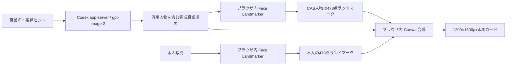

# ⑤「おしごとカード」ローカル顔合成 実装・検証記録

最終更新：2026年8月16日

## 1. 結論

旧方式の「CASが頭なしの服を作り、本人写真の頭全体を貼る」処理は廃止した。

現在は次の方式である。

1. Codex app-serverの`gpt-image-2`が、本人写真を受け取らず、汎用人物・職業服・首・手・小道具・背景を一体で生成する。
2. ブラウザ内のMediaPipe Face Landmarkerが、本人写真とCAS画像の顔を各1人だけ検出する。
3. CAS人物からは両目の中心・距離・傾きだけを借り、本人の目・鼻・口・輪郭比率を保ったまま478点を相似変換する。
4. 本人の顔を三角形ごとに配置し、CAS側の低周波の照明・色、顔境界、前髪をPC内でなじませる。
5. CAS側の髪、耳、ヘルメット、首、肩、服、手、小道具、背景は変更しない。

これにより、以前に発生した「首が浮く」「頭だけ大きい」「襟との断面が見える」問題を構造的に避ける。

## 2. 対象と今回やらないこと

```text
対象利用者：イベント参加者と印刷を行うスタッフ
この画面で完了させる1つの仕事：本人写真を外部送信せず、職業場面へ自然に合成したカードを印刷する
利用前の状態：職業を選び、写真を撮影または選択済み
完了後の状態：本人の顔と職業場面が一体に見えるカードをスタッフが確認できる
主な利用端末：会場PCのChrome
既存業務の何を置き換えるか：ZDR未承認時の①「写真を外部画像AIへ送る生成」
今回やらないこと：本人写真の外部送信、本人写真のサーバー保存、顔の美化、年齢変更、体形変更
```

## 3. データ経路



本人写真は次の送信先へ送らない。

- `/api/career/generate`
- `/api/career-card/outfit`
- Codex app-server
- OpenAI画像生成
- 外部Webサーバー

`/api/career-card/outfit`のPOST本文は`careerId`だけを許可する。

## 4. CAS職業場面の要件

CASへは、本人写真も本人の外見情報も渡さない。次を画像指示へ含める。

- 正方形、1人、正面、目線は水平
- 顔は画像幅の約18〜23%、目は画像高さの約30〜33%
- 頭、髪、耳、顎、首、肩、服、手、道具、背景を一体生成
- 性別・外見情報を送らないため、体格、服装、髪型、ポーズを性別中立にする
- 職業が服装・道具・行動・背景から一目で分かる
- 顔は眼鏡・マスク・手・道具・強い影で隠さない
- ヘルメットなどの頭装具は顔を隠さず自然に装着
- 他人、別の顔、顔写真入りポスター、文字、ロゴを出さない
- 危険職は保護具を着用した安全な非緊急場面にする

生成後はSharpで1024×1024pxへそろえるだけである。旧方式の灰色楕円による顔消去は行わない。

## 5. ブラウザ内の顔合成

### 5-1. 顔検出

- `@mediapipe/tasks-vision@1.0.1`
- `face_landmarker.task`のSHA-256を起動時に検証
- 本人写真とCAS画像のそれぞれで、顔が1人だけか確認
- 本人写真は小さすぎる、近すぎる、中央から外れる、傾く、横向きの場合に撮り直しで停止
- CAS画像は顔なし、複数顔、強い傾きの場合にスタッフ案内で停止

異常時に固定楕円や外部AIへ自動的に切り替えない。

### 5-2. 顔メッシュ変形

MediaPipe同梱の顔テッセレーションを使う。CAS画像の顔形状へ各点を直接合わせず、CASの両目の中心・距離・角度へ本人の全ランドマークを単一の相似変換で配置する。その配置先へ、本人写真の対応する三角形をアフィン変換する。

- 顔の内側だけを置き換える
- 本人の目・鼻・口・輪郭の正規化比率を変えない
- CAS人物が変わっても本人の正規化顔形状が変わらない
- CAS側の髪、耳、頭装具、首、体、服、背景は残す
- 三角形の境界は約1px重ね、細い隙間を防ぐ
- 面積が小さすぎる異常三角形は描画しない
- 有効な三角形が不足した場合は停止する

### 5-3. 色と境界

- 本人とCASの顔内側からRGB平均・標準偏差を測る
- 3色共通のコントラスト倍率と上限付きの色補正を使い、顔形状と局所的な特徴を変えない
- CAS顔のぼかした照明と本人顔の細部を周波数分離して合成し、輪郭側ほどCAS照明へ寄せる
- 顔輪郭を少し内側へ縮め、約18pxぼかす
- CASの前髪に該当する暗部を顔合成後に戻し、髪が直線で切れないようにする
- 顔メッシュ変形後に弱い局所シャープ処理を行う
- 顎下と首はCAS画像をそのまま使う

## 6. 失敗時の動作

| 条件 | 動作 |
|---|---|
| 本人写真に顔がない | 撮り直し案内 |
| 本人写真に複数人 | 1人で写る案内 |
| 本人写真が傾く・遠い・近い | 撮り直し案内 |
| CAS画像に顔がない・複数・横向き | スタッフ案内で停止 |
| 顔モデルがない・改変・読込失敗 | スタッフ案内で停止 |
| 合成が時間切れ・有効三角形不足 | スタッフ案内で停止 |

## 7. 2026年8月16日の反復確認

実在人物や参加者写真は使わず、ImageGenで作成した架空成人2人を使用した。

- 顔ひげのある正面成人
- 眼鏡と結んだ髪の正面成人

CAS側は実際の`gpt-image-2`で次の2場面を生成した。

- 機械組立工：工場、作業着、工具、歯車、作業台
- 地質学者：地層、保護ヘルメット、作業服、地質図、岩石、ハンマー

同じCAS画像を固定し、次の順で5回確認した。

1. 機械組立工＋顔ひげあり
2. 1と同条件で局所シャープ処理を追加
3. 機械組立工＋眼鏡あり
4. 地質学者＋顔ひげあり
5. 地質学者＋眼鏡あり

5回すべてで次を目視確認した。

- 首が浮かない
- 顔や目が二重にならない
- 顎と首の切断線が見えない
- CAS側の髪とヘルメットが残る
- 服、手、道具、背景が変わらない
- 本人側の眼鏡または顔ひげが顔領域へ反映される
- 顔と首の明るさ・色が極端に分離しない
- 1200×1600pxカードを出力できる

比較画像は個人データを含まない一時QA成果物として`/tmp/career-card-quality/`で確認し、リポジトリへ保存していない。

## 8. 自動確認

自動テストでは次を確認する。

- 顔0人・1人・複数人の判定
- 本人写真とCAS画像で異なる最小顔サイズを使うこと
- 三角形アフィン変換が3頂点を正しい位置へ写すこと
- 異常三角形を拒否すること
- 本人の正規化顔形状がCAS人物の顔形状へ置き換わらないこと
- CAS人物を変えても本人の目・鼻・口比率が変わらないこと
- 同じCAS人物でも本人が違えば出力顔形状も変わること
- 色補正が上限内かつ0〜255に収まること
- Face Landmarkerと固定モデルの起動確認
- ⑤のPOST本文が`careerId`だけであること
- 本人写真を含むAPI通信が0件であること
- ローカル合成ファイルの外部オリジン取得が0件であること
- 完成カードがブラウザ内PNGの1200×1600pxであること
- PC 1366×768とモバイル390×844で横スクロールがないこと
- 眼鏡ありの架空成人で実際のMediaPipe経路が完了すること

## 9. 未確認事項と運用条件

次はAIだけでは完了扱いにしない。

- 添付された本人写真と同一条件での再確認
- 実参加者による本人らしさの確認
- 子どもとCAS人物の体格・見た目年齢の組み合わせ確認
- 低照度、逆光、強い眼鏡反射、前髪、マスク、横顔の母数確認
- 4台同時生成時のCAS待ち時間と失敗率
- 実プリンターでの色、余白、境界確認

印刷前にスタッフが、顔、首、頭装具、手、道具、職業の一致を1件ずつ確認する。見た目が不自然なカードは印刷せず撮り直す。

**利用者検証前。**
